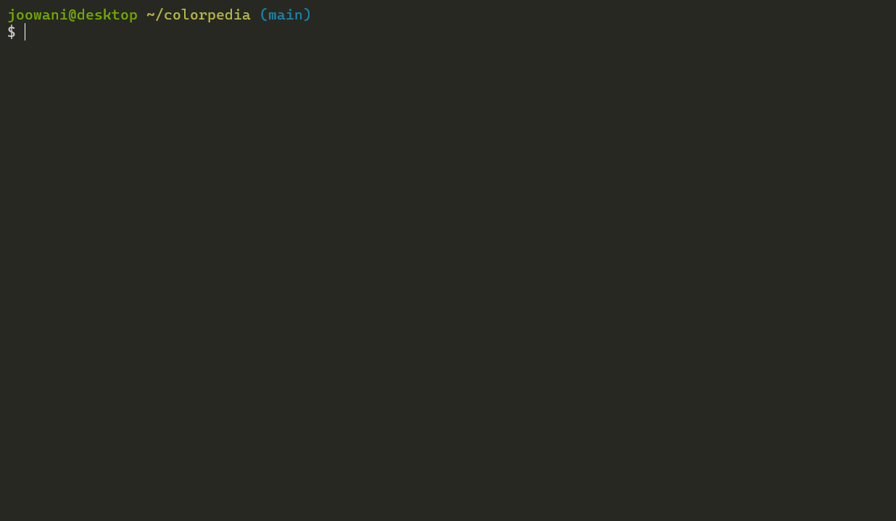

## Colorpedia

Command-line tool for looking up colors, shades and palettes.

Supported [color models](https://en.wikipedia.org/wiki/Color_model):
HEX, RGB, HSL, HSV, CMYK




[](https://codecov.io/gh/joowani/colorpedia)

### Requirements

* Modern terminal with true color and utf-8 support
  (e.g. Windows Terminal, PowerShell, iTerm2, Terminator)
* Python 3.6+

### Installation

Install via [pip](https://pip.pypa.io):

```shell
pip install colorpedia
```

For conda users:

```shell
conda install colorpedia -c conda-forge
```

After installation you can use the `color` command:

```shell
color --help
```

If you have a name collision on Windows, use `colorpedia` instead:

```shell
colorpedia --help
```

### Usage

Look up colors using various color models:

```shell
color name green            # CSS3 color name
color hex FFFFFF            # hex code without the hash (#) prefix
color rgb 255 255 255       # RGB (Red Green Blue)
color hsl 360 100 100       # HSL (Hue Saturation Lightness)
color hsv 360 100 100       # HSV (Hue Saturation Brightness)
color cmyk 100 100 100 100  # CMYK (Cyan Magenta Yellow Black)
```

Use `--shades` to display dark to light shades of a color:

```shell
color name green --shades    # Display 15 colors by default
color hex FFFFFF --shades=5  # Display 5 shades
```

Look up color palettes:

```shell
color palette molokai
color palette blue
color palette kelly
```

Control output with global flags:

```shell
color name yellow --all      # Display all details
color name yellow --json     # Display in JSON format
color name yellow --units    # Display unit symbols
color name yellow --nojson   # Do not display in JSON
color name yellow --nounits  # Do not display unit symbols
```

Combine with other tools like [jq](https://github.com/stedolan/jq):

```shell
color palette molokai | cut -d'|' -f 2,3,4
color name blue --range --json | jq .[0].name
```

Use `--help` to display more information on each subcommand:

```shell
color name --help
color rgb --help
color palette --help
```

### Tab Completion

For Bash, add the following line in `~/.bashrc`:

```shell
source <(color -- --completion)
```

For Zsh, add the following lines in `~/.zshrc`:

```shell
autoload -U +X compinit && compinit
autoload -U +X bashcompinit && bashcompinit

source <(color -- --completion | sed "s/:/: /g")
```

Replace `color` with `colorpedia` if you choose to use the longer command.

### Configuration

Initialize the config file to customize CLI behavior:

```shell
color config init
```

The command above creates `~/.config/colorpedia/config.json` with default settings:

```json5
{
  // Always display in JSON format. Use with --nojson flag.
  "always_output_json": false,
  // Suffix for approximate color names (e.g. "green~").
  "approx_name_suffix": "~",
  // Default number of shades displayed when --shades is used without a count.
  "default_shades_count": 15,
  // Display degrees angle (°) symbol. Use with --nounits flag.
  "display_degree_symbol": false,
  // Display percentage (%) symbol. Use with --nounits flag.
  "display_percent_symbol": false,
  // Height of the color box displayed in single-color (get) view.
  "get_view_color_height": 10,
  // Width of the color box displayed in single-color (get) view.
  "get_view_color_width": 20,
  // Keys displayed in single-color (get) view.
  "get_view_keys": [
    "name",
    "hex",
    "rgb",
    "color",
    "hsl",
    "hsv",
    "cmyk"
  ],
  // Keys displayed in JSON view.
  "json_keys": [
    "name",
    "is_name_exact",
    "hex",
    "rgb",
    "hsl",
    "hsv",
    "cmyk"
  ],
  // Width of the color box displayed in multi-color (list) view.
  "list_view_color_width": 20,
  // Keys displayed in multi-color (list) view.
  "list_view_keys": [
    "name",
    "hex",
    "rgb",
    "color",
    "hsl",
    "hsv",
    "cmyk"
  ],
  // Always uppercase hex codes if set to true, lowercase if set to false.
  "uppercase_hex_codes": true
}
```

Display or edit the configuration file:

```shell
color config show  # Display configuration
color config edit  # Edit configuration via a text editor
```

### Technical Notes

- Names of "unknown" colors are approximated using minimum RGB delta:
  ```
  delta = (R1 - R2) ^ 2 + (G1 - G2) ^ 2 + (B1 - B2) ^ 2
  ```
  If there is are ties, all names are included in the output.
- Percentage values use 0 - 100 scale by default, 0 - 1 scale in JSON.
- Degree angles use 0 - 360 scale by default, 0 - 1 scale in JSON.
- Percent and degree unit symbols are omitted in JSON.
- If HSV/HSL/CMYK values do not map exactly to an RGB triplet, they are rounded to the
  nearest one.

### Contributing

Set up dev environment:

```shell
cd ~/your/colorpedia/clone  # Activate venv if you have one (recommended)
pip install -e .[dev]       # Install dev dependencies (black, mypy, pre-commit etc.)
pre-commit install          # Install git pre-commit hooks
```

Run unit tests with coverage:

```shell
py.test --cov=colorpedia --cov-report=html
```
